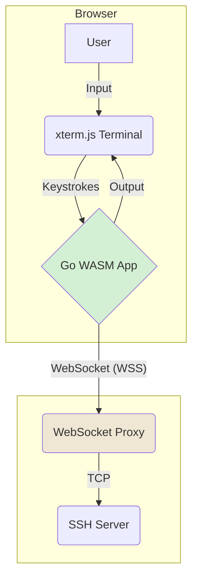

# SSH Term Design

This document provides a detailed explanation of the SSH Term project, including its architecture, security considerations, language choices, and how it addresses key technical challenges.

## Project Overview

SSH Term is a full-featured SSH and SFTP client that runs entirely in a web browser. It provides a terminal interface and supports a wide range of SSH features, including public key authentication, agent forwarding, and certificate-based authentication.

The core of the client is written in Go and compiled to WebAssembly (WASM). This allows the SSH client logic to run directly in the browser, providing a secure and sandboxed environment. The frontend is built with HTML, JavaScript, and the [xterm.js](https://xtermjs.org/) library for terminal emulation.

A key component of the architecture is a WebSocket-to-TCP proxy, such as `TLSPROXY`. Since browsers cannot make direct TCP connections, SSH Term connects to a WebSocket endpoint, which the proxy then forwards to the target SSH server.

### Key Features

*   **In-Browser SSH Client:** The entire SSH client runs client-side as a WebAssembly module.
*   **Terminal Emulation:** Uses xterm.js for a full-featured terminal experience.
*   **SFTP Support:** Includes an interactive SFTP client for file transfers.
*   **Key Management:** Supports generation, import, and export of various SSH key types (RSA, ECDSA, Ed25519, and `ecdsa-sk` via WebAuthn).
*   **SSH Agent:** An in-memory SSH agent implementation allows for agent forwarding.
*   **Certificate Authentication:** Supports both host and user certificates.
*   **WebAuthn Support:** `ecdsa-sk` keys can be created and used, leveraging hardware security keys and passkeys.
*   **Local Storage:** Configuration, keys, and known hosts are persisted in the browser's IndexedDB.

## Architecture

The application is composed of three main parts:

1.  **Go WebAssembly Module (`ssh.wasm`):** This is the heart of the application. It contains the entire SSH and SFTP client logic, key management, agent, and command-line interface for the terminal. It is written in Go and compiled to WebAssembly.
2.  **JavaScript Frontend (`ssh.js`, `xterm.js`):** The frontend code is responsible for loading the WASM module, creating the xterm.js terminal, and handling user interaction. It acts as the glue between the Go application and the browser environment.
3.  **WebSocket Proxy (`TLSPROXY`):** A separate server component that bridges the WebSocket connection from the browser to the TCP connection required by the SSH server. This is a critical piece of infrastructure that makes the whole system work.

The following diagram illustrates the overall architecture and data flow:

The data flow is as follows:
1.  The user interacts with the xterm.js terminal in the browser.
2.  Input is passed from the terminal to the Go WASM application.
3.  The Go application processes the commands and establishes a secure WebSocket (WSS) connection to the proxy.
4.  The WebSocket proxy terminates the WSS connection and establishes a standard TCP connection to the target SSH server.
5.  Output from the SSH session flows back through the proxy to the Go application and is displayed in the xterm.js terminal.

## Security Considerations

Security is paramount for an SSH client. Running in a browser introduces a unique set of challenges and considerations.

*   **Sandboxing:** The entire Go application runs within the browser's WebAssembly sandbox. This provides a strong layer of isolation from the user's operating system. The application has no direct access to the local filesystem or other system resources, except through explicit user actions (e.g., file uploads/downloads) or browser APIs (e.g., IndexedDB).

*   **Private Keys:** SSH private keys are stored in the browser's IndexedDB. This data is protected by the browser's same-origin policy, which prevents other websites from accessing it. However, the data is not encrypted at rest by default within IndexedDB. To mitigate this, SSH Term employs strong encryption:
    *   **Key Encryption:** Individual private keys are encrypted with a user-provided passphrase using the standard OpenSSH keystore format.
    *   **Database Backup:** The full database backup feature encrypts the entire dataset using a key derived from a passphrase with **PBKDF2** and then symmetrically encrypted with **XSalsa20-Poly1305** (via `nacl/secretbox`). This ensures that sensitive data, including keys and configuration, is protected when exported.

*   **Cross-Site Scripting (XSS):** The application is a single-page app and does not render any user-provided HTML. The terminal output is handled by xterm.js, which is designed to safely render terminal escape sequences and text. The Content Security Policy (CSP) is set to `default-src 'self'; style-src 'unsafe-inline' 'self'; script-src 'unsafe-eval' 'self';`, which helps to mitigate XSS risks. The `'unsafe-eval'` is required for the Go WASM runtime.

*   **Cross-Site Request Forgery (CSRF):** `TLSPROXY` requires a CSRF token (`__tlsproxySid` cookie and `x-csrf-token` header) for certificate requests, which is implemented in this application.

*   **WebSocket Proxy (`TLSPROXY`):** The security of the WebSocket proxy is critical. It is always configured to use TLS (WSS) to encrypt the traffic between the browser and the proxy. The proxy is also responsible for access control, determining which users can connect to which SSH servers.

*   **WebAuthn:** The use of `ecdsa-sk` keys with WebAuthn provides a very high level of security for user authentication. The private key material never leaves the hardware security key or secure enclave.

*   **Dependencies:** The project relies on `xterm.js` for terminal emulation. It's important to keep this and other dependencies up-to-date to patch any security vulnerabilities.

## Choice of Language

*   **Go:** Go is a good choice for the core client logic.
    *   **Strong Networking and Cryptography Libraries:** Go's standard library has robust support for networking, cryptography, and SSH, which are all essential for this project.
    *   **WebAssembly Support:** Go has first-class support for compiling to WebAssembly, making it possible to run the client in the browser.
    *   **Performance:** Go is a compiled language that offers good performance, which is important for a responsive terminal application.
    *   **Static Typing:** Go's static type system helps to catch errors at compile time and makes the code more maintainable.

*   **JavaScript:** JavaScript is the natural choice for the frontend.
    *   **Browser Integration:** It's the language of the web and is necessary for interacting with the DOM, browser APIs, and libraries like xterm.js.
    *   **UI and Event Handling:** JavaScript is used to create the terminal, handle user input, and manage the overall application lifecycle in the browser.

## Significant Challenges and Solutions

*   **SSH in the Browser:** The biggest challenge is that browsers cannot create raw TCP sockets.
    *   **Solution:** This is solved by using WebSockets and a WebSocket-to-TCP proxy. The Go application implements the `net.Conn` interface over a WebSocket connection, allowing the standard Go SSH library to be used with minimal modification.

*   **Terminal I/O and Emulation:** A web application needs to provide a fully functional terminal.
    *   **Solution:** The project uses `xterm.js`, a popular and well-maintained library that provides an accurate and performant terminal emulator in the browser. The Go application interacts with `xterm.js` through a JavaScript bridge to handle input and output.

*   **Secure Key Storage and Management:** Storing and using SSH keys in a browser is a significant security challenge.
    *   **Solution:** Private keys are encrypted with a user-provided passphrase before being stored in IndexedDB. The application also leverages the WebAuthn API to support hardware-backed keys, where the private key never leaves the security token.

*   **File Transfers (SFTP):** Getting files in and out of the browser sandbox is not straightforward.
    *   **Solution:** For downloads, the application uses a Service Worker to stream files from the SFTP server directly to the user's machine, avoiding the need to buffer large files in memory. For uploads, it uses the standard file input element and streams the file content to the SFTP server. Drag-and-drop is also supported. For a more detailed explanation of the streaming implementation, see [STREAMS.md](STREAMS.md).

*   **Agent Forwarding:** Implementing SSH agent functionality in the browser.
    *   **Solution:** The project includes an in-memory SSH agent implementation in Go. This agent can be populated with keys (after decrypting them with a passphrase) and forwarded to remote servers, just like a native SSH agent. The agent's contents are cleared on page reload.

