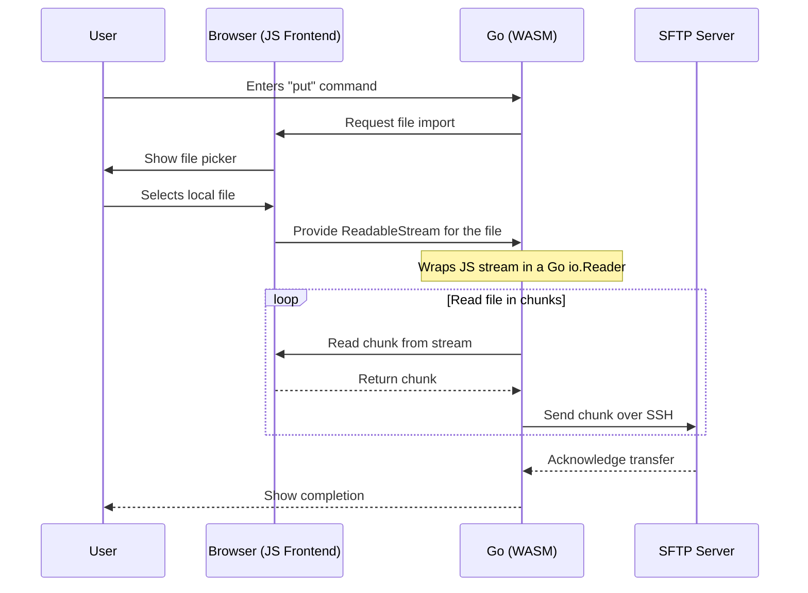
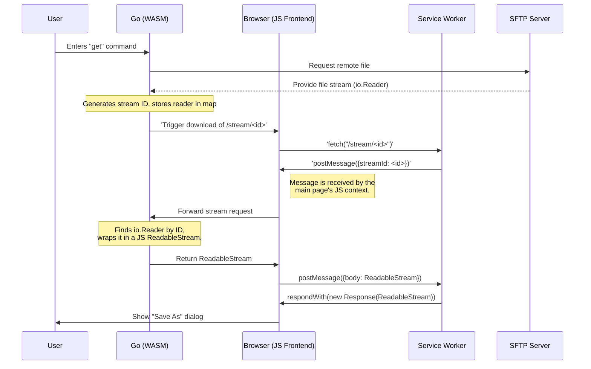

# Streaming Data in SSH Term

One of the primary challenges in a browser-based application like SSH Term is efficiently moving data between the user's local machine and the sandboxed WebAssembly (WASM) application. This is especially critical for file transfers (SFTP), where files can be too large to fit into memory. SSH Term uses two distinct, stream-based approaches for uploads and downloads.

This document explains the technical implementation of these streaming mechanisms, focusing on the interaction between the Go code in `go/internal/jsutil/streams.go` and the Service Worker in `docroot/stream-helper.js`.

## Streaming Uploads (Local Machine to Remote Server)

Streaming uploads are relatively straightforward and do not involve the Service Worker. The process relies on the browser's ability to provide a readable stream for a local file selected by the user.

### Process Flow

1.  **User Action:** The user initiates an upload via the `put` command in an SFTP session or by dragging and dropping a file onto the terminal.

2.  **File Selection:** The application uses the browser's standard file input mechanism (`<input type="file">` or the `DataTransfer` API for drag-and-drop).

3.  **Stream Creation (JavaScript):** When the user selects a file, the browser provides a `File` object. Crucially, this object has a `.stream()` method that returns a [ReadableStream](https://developer.mozilla.org/en-US/docs/Web/API/ReadableStream). This allows the file's content to be read in chunks without loading the entire file into memory.

4.  **Go-side Wrapper (`streams.go`):**
    *   The JavaScript `ReadableStream` is passed to the Go WASM module.
    *   The `jsutil.NewStreamReader(stream)` function creates a Go `io.ReadCloser` that wraps the JavaScript stream.
    *   The `StreamReader` struct holds a reference to the stream's `ReadableStreamDefaultReader`.
    *   Its `Read()` method is a Go-native method that, under the hood, calls the JavaScript reader's `.read()` method asynchronously, waits for the promise to resolve, and copies the resulting chunk of data into the Go byte slice.

5.  **SFTP Upload:**
    *   The SFTP client in `go/internal/app/sftp.go` receives this `io.ReadCloser`.
    *   It treats it like any standard Go `io.Reader` and reads from it, sending the data over the SSH connection to the remote server.

This "pull" model is efficient for memory, as only small chunks of the file are held in memory at any given time during the transfer.

### Upload Visualization

## Streaming Downloads (Remote Server to Local Machine)

Streaming downloads are more complex due to the browser sandbox. The WASM application cannot directly write a file to the user's disk. To solve this, SSH Term uses a Service Worker (`stream-helper.js`) to act as a proxy between the Go application and the browser's download manager. This allows the application to serve a file to the browser as if it were a regular web download, without buffering the entire file in the main application's memory.

### Components

*   **`go/internal/jsutil/streams.go`:** Contains the Go-side logic (`StreamHelper`) to manage the stream and communicate with the Service Worker.
*   **`docroot/stream-helper.js`:** A Service Worker script that intercepts specific network requests and serves responses generated by the Go application.

### Process Flow

1.  **User Action:** The user initiates a download via the `get` command in an SFTP session. The Go SFTP client gets an `io.ReadCloser` for the remote file.

2.  **Stream Registration (`streams.go`):**
    *   The `StreamHelper.Download()` function is called with the `io.ReadCloser` for the remote file.
    *   It generates a unique, random `streamId`.
    *   It stores the `io.ReadCloser` in a map, keyed by the `streamId`. This map holds the live data streams waiting to be consumed.

3.  **Download Trigger:**
    *   A special URL is constructed: `./stream/<streamId>`.
    *   The Go code dynamically creates an `<a>` HTML element with its `href` set to this URL and programmatically clicks it. This tells the browser to "download" the URL.

4.  **Service Worker Interception (`stream-helper.js`):**
    *   The Service Worker is registered to control the page and has an `onfetch` event listener.
    *   It intercepts the browser's `GET` request for `./stream/<streamId>`.
    *   It extracts the `streamId` from the URL.

5.  **Stream Request Handshake:**
    *   The Service Worker sends a message containing the `streamId` back to the main application page using `client.postMessage()`. This is a request for the actual data stream.
    *   The `onmessage` handler in `streams.go` (set up during `NewStreamHelper` initialization) receives this request.

6.  **Stream Provisioning (`streams.go`):**
    *   The Go code looks up the `streamId` in its map to find the corresponding `io.ReadCloser`.
    *   It then creates a JavaScript `ReadableStream` that wraps the Go `io.ReadCloser` using the `NewReadableStream` function.
    *   `NewReadableStream` has a `pull` method. When the browser is ready for more data, it calls `pull`, which in turn reads a chunk from the Go `io.Reader` and `enqueue`s it into the JavaScript stream. This bridges the Go and JavaScript streaming worlds.

7.  **Response Generation (`stream-helper.js`):**
    *   The Go code sends the newly created `ReadableStream` back to the Service Worker via `postMessage`.
    *   The Service Worker receives the stream and uses it to construct a `Response` object. It also sets appropriate headers like `Content-Disposition` to give the file a name.
    *   The `fetch` event's `respondWith()` method is called with this `Response`.

8.  **File Download:** The browser receives the `Response` from the Service Worker and treats it as a standard file download, saving the streamed data to the user's local disk. The main application page never has to hold the entire file in memory.

This solution allows the sandboxed Go application to provide a data stream that the browser can consume natively for downloads, providing an efficient and user-friendly experience for large files.

### Download Visualization

